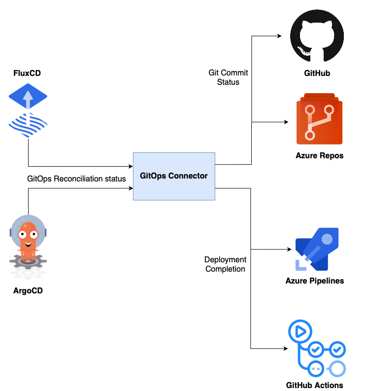
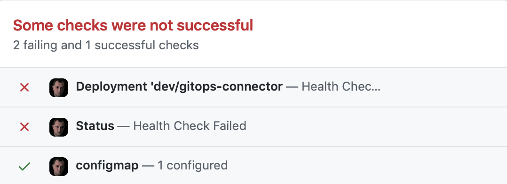
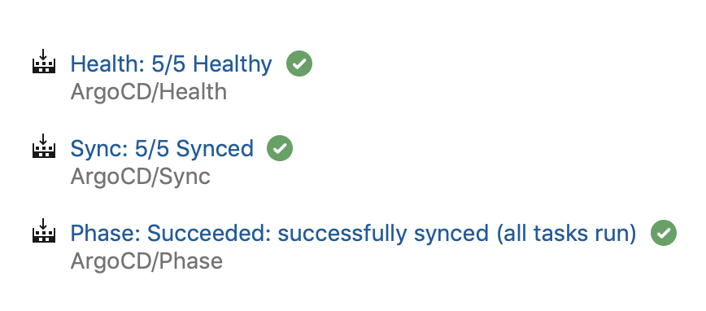

# GitOps Connector

GitOps Connector is a custom component with the goal of enriching the integration of a GitOps operator and a CI/CD orchestrator so the user experience in the entire CI/CD process is smoother and more observable. The whole process can be handled and monitored from a CI/CD orchestrator.



During the reconciliation process a GitOps operator notifies on every phase change and every health check the GitOps connector. This component serves as an adapter, it "knows" how to communicate to a Git repository and it updates the Git commit status so the synchronization progress is visible in the Manifests repository. When the reconciliation including health check has successfully finished or failed the connector notifies a CI/CD orchestrator, so the CD pipelines/workflows may perform corresponding actions such as testing, post-deployment activities and moving on to the next stage in the deployment chain.

Refer to the following implementations to understand the role the GitOps Connector plays in various GitOps flows:

- [GitOps with Azure DevOps and ArgoCD/Flux](https://github.com/kaizentm/cloud-native-ops/blob/master/docs/azdo-gitops.md)
- [HLD based CI/CD Pipeline with GitOps connector](https://github.com/kaizentm/cloud-native-ops/blob/master/docs/cicd-hld-pipeline.md)
- [GitOps with GitHub and Flux v2](https://github.com/kaizentm/cloud-native-ops/blob/master/docs/azdo-gitops-githubfluxv2.md)

## GitOps operators

The GitOps Connector supports the following Git Ops operators:

- [FluxCD](https://fluxcd.io)
- [ArgoCD](https://argoproj.github.io/argo-cd/)

## Git Commit Status Update

The GitOps Connector supports the following Git repositories:

- [Azure Repos](https://azure.microsoft.com/services/devops/repos/)
- [GitHub](https://github.com)

The connector reports the deployment process updates to the Git repositories with the Git commit status:

|Commit Status in GitHub|Commit Status in Azure Repos|
|---------|-----------|
|||


In addition to updating the Git commit status in Git repositories, the GitOps connector may optionally notify a list of custom subscribers with a json payload:

|Attribute|Description|Sample|
|---------|-----------|------|
|commit_id| Commit Id in Manifests repo|42e2e5af9d49de268cd1fda3587788da4ace418a|
|status_name| Event context | Sync; Health|
|state| Event state | Progressing; Failed|
|message| Full event message | Pending - Fetched revision 42e2e5af9d49de268cd1fda3587788da4ace418a|
|callback_url| Callback URL with the details | https://github.com/kaizentm/gitops-manifests/commit/42e2e5af9d49de268cd1fda3587788da4ace418a|
|gitops_operator| GitOps operator (Flux or ArgoCD) | Flux|
|genre| Message category | GitRepository |


Refer to [installation guide](#installation) for the details on configuring a list of custom subscribers. 


## Notification on Deployment Completion

The GitOps connector analyzes the incoming messages from the GitOps operator and figures out when the deployment is finished, successfully or not. It notifies on this event the CI/CD orchestrator, so the orchestrator can proceed with the CD process.

The notification mechanism on deployment completion varies for different CI/CD orchestrators.

### Azure Pipelines

An Azure CD pipeline is supposed to create a PR to the manifests repo and wait in agentless mode until the PR is merged and the GitOps operator finishes the deployment. It may use PR properties as a storage for the agentless task callback parameters. 
When the deployment is finished, the GitOps connector seeks the PR to the manifest repo that caused the deployment and looks for the PR's properties under the **/callback-task-id** path. It expects to find a json object with the following data: 

```
{"taskid":"$(System.TaskInstanceId)",
 "jobid:"$(System.JobId)",
 "planurl":"$(System.CollectionUri)",
 "planid":"$(System.PlanId)",
 "projectid":"$(System.TeamProjectId)",
 "pr_num":"$(pr_num)"}
```

The GitOps connector uses this data to provide a callback to the agentless task with the following API:

```
POST {planurl}{projectid}/_apis/distributedtask/hubs/build/plans/{planid}/events?api-version=2.0-preview.1
payload = {
    'name': "TaskCompleted",
    'taskId': {taskid},
    'jobid': {jobid},
    'result': "succeeded"/"failed"
}
```

Refer to [a sample of such agentless task](https://github.com/kaizentm/cloud-native-ops/blob/master/.pipelines/pr-completion-task-template.yaml) for the implementation details.

### GitHub Actions

If the CI/CD orchestrator is GitHub Actions, the GitOps connector sends a [dispatch event](https://docs.github.com/en/rest/reference/repos#create-a-repository-dispatch-event) on the successful deployment completion:

```
POST /repos/{owner}/{repo}/dispatches
payload = {
    'event_type': "sync-success",
    'client_payload': {'sha': {commmit_id},                //Commit Id in source repo that started the CI/CD process 
                      'runid': {github_workflow_run_id}    //GitHub Actions Workflow RunId that produced artifacts (e.g. Docker Image Tags)
    }
```

If the deployment fails, the connector doesn't send a dispatch event to GitHub Actions.

For the implementation details refer to [the CD workflow in this repo](.github/workflows/cd.yaml) that consumes CI artifacts, generates manifests and issues a PR to the manifests repo. Also, look at [the publish workflow](.github/workflows/publish.yaml) which is triggered on the deployment completion by the dispatch event from the GitOps connector. 


## Installation

### Install GitOps Connector with Helm

Add **kaizentm** repository to Helm repos:

```
helm repo add kaizentm https://kaizentm.github.io/charts/
```


Prepare **values.yaml** file with the following attributes:

|Attribute|Description|Sample|
|---------|-----------|------|
|gitRepositoryType| Git Repository Type (**AZDO** or **GITHUB**)| GITHUB |
|ciCdOrchestratorType| CI/CD Orchestrator Type (**AZDO** or **GITHUB**)| GITHUB |
|gitOpsOperatorType| GitOps Operator Type (**FLUX** or **ARGOCD**)| FLUX |
|gitOpsAppURL| Call back URL from the Commit Status Window| https://github.com/kaizentm/gitops-manifests/commit; https://github.com/microsoft/spektate|
|orchestratorPAT| GitHub or Azure DevOps personal access token |


If Git Repository Type is AZDO, add the following attributes:
|Attribute|Description|Sample|
|---------|-----------|------|
|azdoGitOpsRepoName| Azure DevOps Mainifests repository name| gen3-manifest |
|azdoOrgUrl| Azure DevOps Organization URL| https://dev.azure.com/DataCommons/ProjectDataCommons |


If CI/CD Orchestrator Type is AZDO, add the following attributes:
|Attribute|Description|Sample|
|---------|-----------|------|
|azdoPrRepoName| Optional. When PRs are not issued to the manifests repo, but to a [separate HLD repo](https://github.com/kaizentm/cloud-native-ops/blob/master/docs/cicd-hld-pipeline.md)  | gen3-hld |
|azdoOrgUrl| Azure DevOps Organization URL| https://dev.azure.com/DataCommons/ProjectDataCommons |


If Git Repository Type is GITHUB, add the following attributes:
|Attribute|Description|Sample|
|---------|-----------|------|
|gitHubGitOpsManifestsRepoName| GitHub Mainifests repository name| gitops-manifests |
|gitHubOrgUrl| API url for the GitHub org| https://api.github.com/repos/kaizentm |


If CI/CD Orchestrator Type is GITHUB, add the following attributes:
|Attribute|Description|Sample|
|---------|-----------|------|
|gitHubGitOpsRepoName| GitHub Actions repository name| gitops-connector |
|gitHubOrgUrl| API url for the GitHub org| https://api.github.com/repos/kaizentm |


Optional. If there are custom Git Commit status subscribers:
|Attribute|Description|Sample|
|---------|-----------|------|
|subscribers| List of key:value pairs defining subscriber name and endpoint | subscribers:<br>&emsp;spektate: 'http://spektate-server:5000/api/flux'


A sample **values.yaml** file for Flux and GitHub might look like this one:

```
gitRepositoryType: GITHUB          
ciCdOrchestratorType: GITHUB
gitOpsOperatorType: FLUX
gitHubGitOpsRepoName: gitops-connector
gitHubGitOpsManifestsRepoName: gitops-manifests
gitHubOrgUrl: https://api.github.com/repos/kaizentm
gitOpsAppURL: https://github.com/kaizentm/gitops-manifests/commit
orchestratorPAT: <PAT>
subscribers:
    spektate: 'http://spektate-server:5000/api/flux'
```

A sample **values.yaml** file for Flux and Azure DevOps might look like this one:

```
gitRepositoryType: AZDO          
ciCdOrchestratorType: AZDO
gitOpsOperatorType: FLUX
azdoGitOpsRepoName: gen3-manifest
azdoOrgUrl: https://dev.azure.com/DataCommons/ProjectDataCommons
azdoPrRepoName: gen3-hld
gitOpsAppURL: https://github.com/microsoft/spektate
orchestratorPAT: <PAT>
subscribers:
    spektate: 'http://spektate-server:5000/api/flux'
```

Install GitOps connector with the following command:

```
helm upgrade -i gitops-connector kaizentm/gitops-connector \
--namespace <NAMESPACE> \
--values values.yaml

#  Check GitOps connector is up and running:
kubectl get pods -l=app=gitops-connector -n <NAMESPACE>

#  Check the connector logs:
kubectl logs -l=app=gitops-connector -n <NAMESPACE> -f
#  DEBUG:root:0 subscribers added.
#  INFO:timeloop:Starting Timeloop..
#  [2021-05-25 00:19:23,595] [timeloop] [INFO] Starting Timeloop..
#  [2021-05-25 00:19:23,595] [timeloop] [INFO] Registered job <function pr_polling_thread_worker at 0x7f3df4f30550>
#  [2021-05-25 00:19:23,596] [timeloop] [INFO] Timeloop now started. Jobs will run based on the interval set
#  INFO:timeloop:Registered job <function pr_polling_thread_worker at 0x7f3df4f30550>
#  INFO:timeloop:Timeloop now started. Jobs will run based on the interval set
#  INFO:root:Starting commit status thread
#  INFO:root:Starting periodic PR cleanup
#  INFO:root:Finished PR cleanup, sleeping for 30 seconds...

```

### Configure FluxCD to send notifications to GitOps connector

[FluxCD Notification Controller](https://fluxcd.io/docs/components/notification/) sends notifications to GitOps connector on events related to **GitRepository** and **Kustomization** Flux resources. Apply the following yaml to the cluster to subscribe GitOps connector instance on Flux notifications: 

```
apiVersion: notification.toolkit.fluxcd.io/v1beta1
kind: Alert
metadata:
  name: gitops-connector
  namespace: <NAMESPACE>
spec:
  eventSeverity: info
  eventSources:
  - kind: GitRepository
    name: <Flux GitRepository to watch>
  - kind: Kustomization
    name: <Flux Kustomization to watch>
  providerRef:
    name: gitops-connector
---
apiVersion: notification.toolkit.fluxcd.io/v1beta1
kind: Provider
metadata:
  name: gitops-connector
  namespace: <NAMESPACE>
spec:
  type: generic
  address: http://gitops-connector:8080/gitopsphase
```

### Configure ArgoCD to send notifications to GitOps connector

[ArgoCD Notifications](https://argocd-notifications.readthedocs.io/en/stable/) sends updates on every deployment phase. Apply the following yaml to the cluster to subscribe GitOps connector instance on ArgoCD notifications:  

```
apiVersion: v1
kind: ConfigMap
metadata:
  name: argocd-notifications-cm
  namespace: <NAMESPACE>
data:
  config.yaml: |
    triggers:
      - name: sync-operation-failed
        condition: app.status.operationState.phase in ['Error', 'Failed']
        template: sync-operation-status-change
      - name: sync-operation-succeeded
        condition: app.status.operationState.phase in ['Succeeded']
        template: sync-operation-status-change
      - name: sync-operation-running
        condition: app.status.operationState.phase in ['Running']
        template: sync-operation-status-change
      - name: sync-operation-progressing
        condition: app.status.health.status in ['Progressing']
        template: sync-operation-status-change
      - name: sync-operation-healthy
        condition: app.status.health.status in ['Healthy'] && app.status.operationState.phase in ['Succeeded']
        template: sync-operation-status-change
      - name: sync-operation-unhealthy
        condition: app.status.health.status in ['Unknown', 'Suspended', 'Degraded', 'Missing']
        template: sync-operation-status-change
    templates:
      - name: sync-operation-status-change
        webhook:
          test-receiver:
            method: POST
            body: |
              {
                "commitid": "{{.app.status.operationState.operation.sync.revision}}",
                "phase": "{{.app.status.operationState.phase}}",
                "sync_status": "{{.app.status.sync.status}}",
                "health": "{{.app.status.health.status}}",
                "message": "{{.app.status.operationState.message}}",
                "resources": {{toJson .app.status.resources}}
              }
---
apiVersion: v1
kind: Secret
metadata:
  name: argocd-notifications-secret
  namespace: <NAMESPACE>
stringData:
  notifiers.yaml: |
    webhook:
    - name: test-receiver
      url: http://gitops-connector:8080/gitopsphase
      headers:
      - name: Content-Type
        value: application/json
type: Opaque      
```        

## Contributing

This project welcomes contributions and suggestions. Most contributions require you to agree to a Contributor License Agreement (CLA) declaring that you have the right to, and actually do, grant us the rights to use your contribution. For details, visit <https://cla.microsoft.com.>

This project has adopted the [Microsoft Open Source Code of Conduct](https://opensource.microsoft.com/codeofconduct/). For more information see the [Code of Conduct FAQ](https://opensource.microsoft.com/codeofconduct/faq/) or contact [opencode@microsoft.com](mailto:opencode@microsoft.com) with any additional questions or comments.
